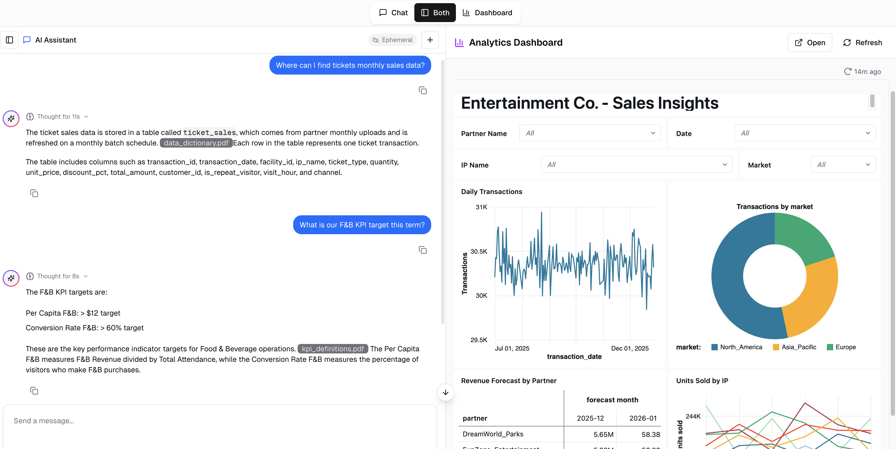

# 🎮 Entertainment Co. Analytics Platform

An end-to-end Databricks demo for a fictional retail entertainment company that manufactures and sells toys. This project showcases the full Databricks platform capabilities—from data engineering to AI agents and business intelligence.

<div align="center">


</div>

---

## 📋 Overview

This repository demonstrates how a toy and entertainment company can use Databricks to analyze:

- 🎫 **Ticket Sales** — Visitor analytics and revenue
- 🍔 **F&B Revenue** — Food & beverage performance  
- 🛍️ **Retail Revenue** — Merchandise and IP-based product sales
- 📈 **Performance Comparisons** — YoY, MoM, QoQ trends
- 🌍 **Market Analysis** — Cross-market and cross-partner comparisons
- 🎯 **IP Performance** — Which toy franchises drive the most revenue
- ⏰ **Peak Times** — Visitor traffic patterns and optimization
- 🔮 **Forecasting** — AI-powered revenue predictions

---

## 💡 Demo Use Case (What this solves)

Entertainment Co. operates theme-park partners and sells tickets, food & beverage, and toys/collectibles. Leadership needs a single experience where:

- **Business users** can ask questions in plain English (“Why did per-capita revenue dip last weekend?”) and get grounded answers.
- **Analysts** can validate the story in a live dashboard, without switching tools.
- **Operators** can spot peak-time patterns and act quickly (staffing, promotions, inventory).

This demo resolves that by combining:

- **Medallion ETL** to produce trusted gold metrics (revenue, per-capita, peak hours, IP performance).
- **AI agents** (Genie + knowledge assistant + multi-agent orchestration) to translate questions into data-backed responses.
- **A Databricks App UI** with **two panels**: a chatbot on the left and an **embedded AI/BI dashboard** on the right.

<div align="center">



</div>

---

## ⚠️ Disclaimer (Example / Reference Only)

This repository is provided **as example code and reference material only**.

- **No maintenance obligations**: The author(s) do not provide ongoing support, updates, security patches, or operational assistance.
- **No warranties**: The contents are provided “as-is”, without warranties of any kind (express or implied), including fitness for a particular purpose.
- **Not production-ready by default**: Any production deployment requires **critical evaluation**, security review, governance alignment, performance testing, cost modeling, and reliability hardening for your environment.
- **Your responsibility**: You are responsible for validating correctness, compliance, access controls, and data protection requirements before using any part of this project in a real system.

---

## 🏗️ Architecture

```
┌─────────────────────────────────────────────────────────────────────┐
│                        MEDALLION ARCHITECTURE                       │
├─────────────────────────────────────────────────────────────────────│
│                                                                     │
│  📁 Volumes (CSV)  ──►  🥉 Bronze  ──►  🥈 Silver  ──►  🥇 Gold     │
│     Raw Files           Raw Tables      Enriched        Aggregated  │
│                                                                     │
├─────────────────────────────────────────────────────────────────────│
│                                                                     │
│  🥇 Gold Tables  ──►  🧞 Genie Space  ──►  🤖 Multi-Agent           │
│                  ──►  📊 AI/BI Dashboard                            │
│                  ──►  🎮 Databricks App                             │
│                                                                     │
└─────────────────────────────────────────────────────────────────────┘
```

---

## 📂 Project Structure

```
e2e-app-entertainment-co/
├── 1_DataEngineering/
│   ├── 1_FakeDataGeneration/
│   │   ├── generate_synthetic_csv_data.py    # Generate 1M+ row CSV files
│   │   └── generate_synthetic_pdf_data.py    # Generate business docs for RAG
│   │
│   └── 2_DataProcessing/
│       ├── 1_load_sheets_to_bronze_tables.py # Bronze: Raw data ingestion
│       ├── 2_load_silver_tables.py           # Silver: Cleaned & enriched
│       └── 3_load_gold_tables.py             # Gold: Aggregated + AI_FORECAST
│
├── 2_Agents/
│   ├── 1_create_genie_space.md               # Natural language SQL queries
│   ├── 2_create_knowledge_assistant.md       # RAG agent for business docs
│   └── 3_create_multi_agent.md               # Orchestrator combining both
│
├── 3_BI_App/
│   ├── 1_create_aibi_dashboard.md            # AI/BI dashboard guide
│   └── 2_create_app/
│       ├── create_databricks_app.md          # Brief Databricks App deployment overview
│       ├── app_screenshot.png                # Demo UI screenshot
│       └── app_code/                         # Databricks App source code (Node/React)
│           ├── app.yaml                      # App runtime + entrypoint
│           ├── client/                       # React UI (chat + embedded dashboard)
│           ├── server/                       # Express API (chat + token endpoints)
│           ├── packages/                     # Shared packages (auth/core/db/utils)
│           └── scripts/                      # Deploy + utility scripts
│
└── 4_Governance/
    └── 1_sharing_with_users.md               # Unity Catalog & sharing guide
```

---

## 🚀 Quick Start

### Prerequisites

- Databricks workspace with Unity Catalog enabled
- Permissions to create catalogs, schemas, and tables
- Access to Genie and AI/BI features

### Step 1: Generate Synthetic Data

```bash
# Run in Databricks
1_DataEngineering/1_FakeDataGeneration/generate_synthetic_csv_data.py
1_DataEngineering/1_FakeDataGeneration/generate_synthetic_pdf_data.py
```

This creates:
- 6 months of transactional data per partner (5 partners)
- ~6M+ rows across ticket sales, F&B, and retail
- Dimension tables for facilities, campaigns, customers, dates
- PDF documents for the knowledge assistant

### Step 2: Run ETL Pipeline

Run these notebooks **in order**:

| Order | Notebook | Creates |
|-------|----------|---------|
| 1️⃣ | `1_load_sheets_to_bronze_tables.py` | 7 bronze tables (raw) |
| 2️⃣ | `2_load_silver_tables.py` | 5 silver tables (cleaned) |
| 3️⃣ | `3_load_gold_tables.py` | 6 gold tables (aggregated) |

### Step 3: Set Up AI & BI

Follow the guides in order:

1. **Genie Space** → `2_Agents/1_create_genie_space.md`
2. **Knowledge Assistant** → `2_Agents/2_create_knowledge_assistant.md`
3. **Multi-Agent** → `2_Agents/3_create_multi_agent.md`
4. **AI/BI Dashboard** → `3_BI_App/1_create_aibi_dashboard.md`
5. **Databricks App** → `3_BI_App/2_create_app.md`

---

## 📊 Data Model

### Bronze Layer (Raw)
| Table | Description |
|-------|-------------|
| `bronze_ticket_sales` | Raw ticket transactions from all partners |
| `bronze_fnb_sales` | Raw F&B transactions |
| `bronze_retail_sales` | Raw retail/merchandise transactions |
| `bronze_dim_facilities` | Facility dimension |
| `bronze_dim_campaigns` | Marketing campaigns |
| `bronze_dim_customers` | Customer dimension |
| `bronze_dim_dates` | Date dimension |

### Silver Layer (Cleaned & Enriched)
| Table | Description |
|-------|-------------|
| `silver_ticket_sales` | Ticket sales with facility info |
| `silver_fnb_sales` | F&B sales with facility info |
| `silver_retail_sales` | Retail sales with facility info |
| `silver_dim_facilities` | Cleaned facilities dimension |
| `silver_dim_campaigns` | Cleaned campaigns dimension |

### Gold Layer (Business-Ready)
| Table | Description |
|-------|-------------|
| `gold_daily_revenue` | Daily revenue by facility (all streams) |
| `gold_monthly_partner_performance` | Monthly KPIs by partner |
| `gold_ip_performance` | Revenue by toy IP/franchise |
| `gold_fnb_item_performance` | F&B item analytics |
| `gold_hourly_patterns` | Peak time analysis |
| `gold_revenue_forecast` | AI_FORECAST predictions |

---

## 🧞 Genie Space Queries

Example natural language questions users can ask:

- *"What was total revenue last month?"*
- *"Which partner has the highest per capita spending?"*
- *"Top 5 performing IPs by retail revenue"*
- *"Compare F&B revenue between North America and Europe"*
- *"What are peak visiting hours on weekends?"*
- *"How did November compare to October?"*

---

## 🎨 Databricks App Features

The included Databricks app (`3_BI_App/app_code/`) provides:

- 💬 **Chatbot Panel** — Talk to the multi-agent supervisor
- 📊 **Dashboard Panel** — Embedded AI/BI dashboard
- 🎮 **Toy-themed UI** — Fun, colorful design with emojis
- 📱 **Responsive Layout** — Works on desktop and tablet

---

## 🔧 Configuration

### Unity Catalog

```
Catalog:  pedroz_catalog
Schema:   entertainment_co
```

### Volume Path

```
/Volumes/pedroz_catalog/entertainment_co/raw_files/
├── partners/
│   ├── DreamWorld_Parks/
│   ├── FunZone_Entertainment/
│   ├── PlayLand_International/
│   ├── ToyBox_Experiences/
│   └── WonderWorld_Co/
└── dimensions/
    ├── dim_facilities.csv
    ├── dim_campaigns.csv
    ├── dim_customers.csv
    └── dim_dates.csv
```

---

## 📈 Key Metrics

| Metric | Definition |
|--------|------------|
| **Total Revenue** | Ticket + F&B + Retail revenue |
| **Per Capita** | Total revenue ÷ Total visitors |
| **Repeat Visit Rate** | (Repeat visitors ÷ Total visitors) × 100 |
| **MoM Change** | (Current - Prior) ÷ Prior × 100 |

---

## 🤖 AI Features

- **AI_FORECAST** — Native Databricks function for time-series predictions
- **Genie** — Natural language to SQL for business users
- **Agent Bricks** — Multi-agent orchestration for complex queries
- **RAG** — Knowledge assistant over PDF documents

---

## 📚 Additional Resources

- [Databricks Unity Catalog Documentation](https://docs.databricks.com/unity-catalog/)
- [Genie Spaces Guide](https://docs.databricks.com/genie/)
- [AI/BI Dashboards](https://docs.databricks.com/dashboards/)
- [Databricks Apps](https://docs.databricks.com/apps/)

---

## 👥 Sharing & Governance

See `4_Governance/1_sharing_with_users.md` for detailed instructions on:

- Granting access via Unity Catalog
- Sharing dashboards and Genie spaces
- Using Databricks One for end-user access
- Row-level security and data masking

---

---

<div align="center">

🧸 🎲 🪀 🎨 🚀 🦕 🦄 🤖 🎪 🎡 🎢 🎠

</div>
